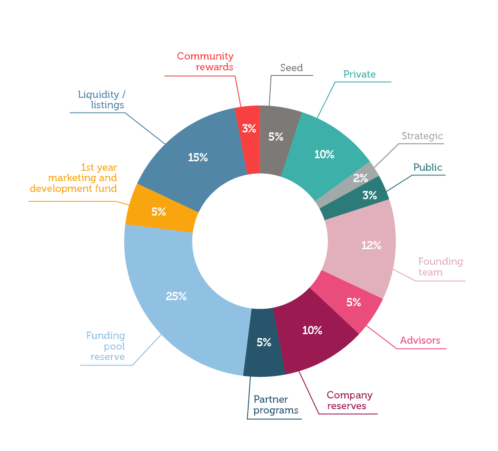

# Tokenomics

‌Token name: $dAngel &#x20;

‌Total supply: 250.000.000&#x20;

| **Token Distribution**                  | **Percentage** | **Vesting Schedule**                                                   |
| --------------------------------------- | -------------- | ---------------------------------------------------------------------- |
| Seed sale                               | 5%             | 5% unlocked at TGE, 3 months cliff period, 10% monthly linear vesting  |
| Private sale                            | 10%            | 5% unlocked at TGE, 3 months cliff period, 10% monthly linear vesting  |
| Strategic sale                          | 2%             | 100% locked at TGE, 6 months cliff period, 10% monthly linear vesting  |
| Public sale                             | 3%             | 50% unlocked at TGE, 50% vesting in 1 month                            |
| Founding team                           | 12%            | 100% locked at TGE, 6 months cliff period, 5% monthly linear vesting   |
| Advisors                                | 5%             | 100% locked at TGE, 6 months cliff period, 5% monthly linear vesting   |
| Company reserves                        | 10%            | 100% locked at TGE, 12 months cliff period, 10% monthly linear vesting |
| Partner programs                        | 5%             | 100% locked at TGE, 3 months cliff period, 10% monthly linear vesting  |
| Funding pool reserve                    | 25%            | 100% locked at TGE, 2.5% monthly linear vesting                        |
| 1st year marketing and development fund | 5%             | 100% locked at TGE, 10% monthly linear vesting                         |
| Liquidity / listings                    | 15%            | 7% unlocked at TGE, 10% monthly linear vesting                         |
| Community rewards                       | 3%             | 5% unlocked at TGE, 20% monthly linear vesting                         |
| Total                                   | 100%           |                                                                        |
|                                         |                |                                                                        |

&#x20;

Token Utilities

* Allocations to private and curated pools are exclusive to $dAngel token holders
* $dAngel tokens can be staked for longer periods to earn rare allocations
* Voting rights and project governance when DAO is formed
* Access to various community programs
