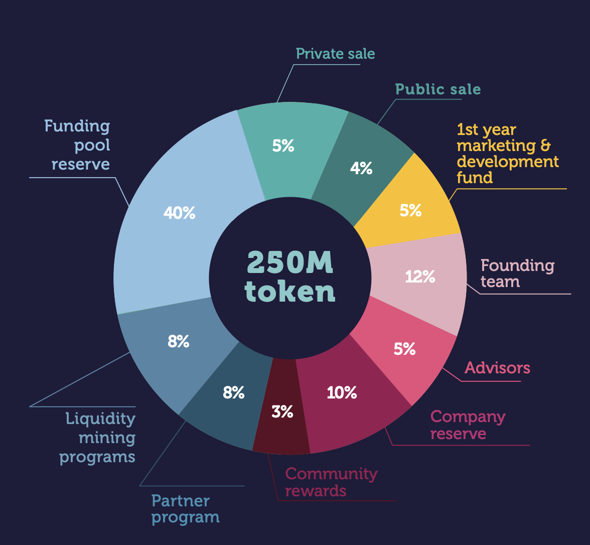

# Tokenomics

‌Token name: $dAngel &#x20;

‌Initial token type: BEP-20

‌Total supply: 250.000.000&#x20;

| **Token Distribution**                  | **Percentage** | **Vesting Schedule**                                                        |
| --------------------------------------- | -------------- | --------------------------------------------------------------------------- |
| Private sale                            | 5%             | 10% unlocked at TGE, 3 months cliff period, linear vesting until 12th month |
| Public sale                             | 4%             | 100% unlocked at TGE                                                        |
| First Year Marketing & Development Fund | 5%             | 100% locked at TGE, linear vesting until 12th month                         |
| Founding Team                           | 12%            | 100% locked at TGE, 6 months cliff period, linear vesting until 24th month  |
| Advisors                                | 5%             | 100% locked at TGE, 6 months cliff period, linear vesting until 24th month  |
| Company Reserve                         | 10%            | 100% locked at TGE, 12 months cliff period, linear vesting until 24th month |
| Community Rewards                       | 3%             | 20% unlocked at TGE, linear vesting until 6th month                         |
| Partner Program                         | 8%             | 10% unlocked at TGE, linear vesting until 15th month                        |
| Liquidity Mining Programs               | 8%             |  10% unlocked at TGE, linear vesting until 12th month                       |
| Funding Pool Reserve                    | 40%            | 4% unlocked at TGE, linear vesting until 36th month                         |
| Total                                   | 100%           |                                                                             |

&#x20;

Token Utilities

* Allocations to private and curated pools are exclusive to $dAngel token holders
* $dAngel tokens can be staked for longer periods to earn rare allocations
* Voting rights and project governance when DAO is formed
* Access to various community programs
